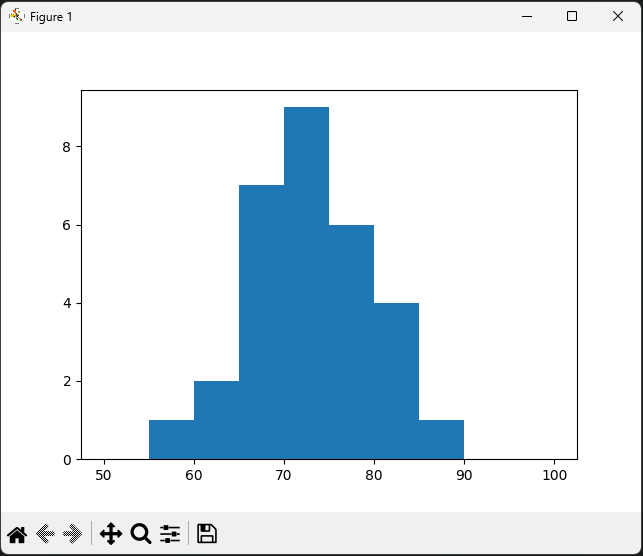

# Grade Calculator

**Image**: is [quiz1_hist.png](quiz1_hist.png), or see visual below

## Outputs
#### Option 3
```bash
1. Student grade
2. Assignment statistics
3. Assignment graph

Enter your selection: 3
What is the student's name: Quiz 1
```


#### Option 2
```bash
1. Student grade
2. Assignment statistics
3. Assignment graph

Enter your selection: 2
What is the assignment name: Quiz 1
Min: 56%
Avg: 72%
Max: 86%
```

#### Option 1
```bash
1. Student grade
2. Assignment statistics
3. Assignment graph

Enter your selection: 1
What is the student's name: Michael Potter
67%
```
